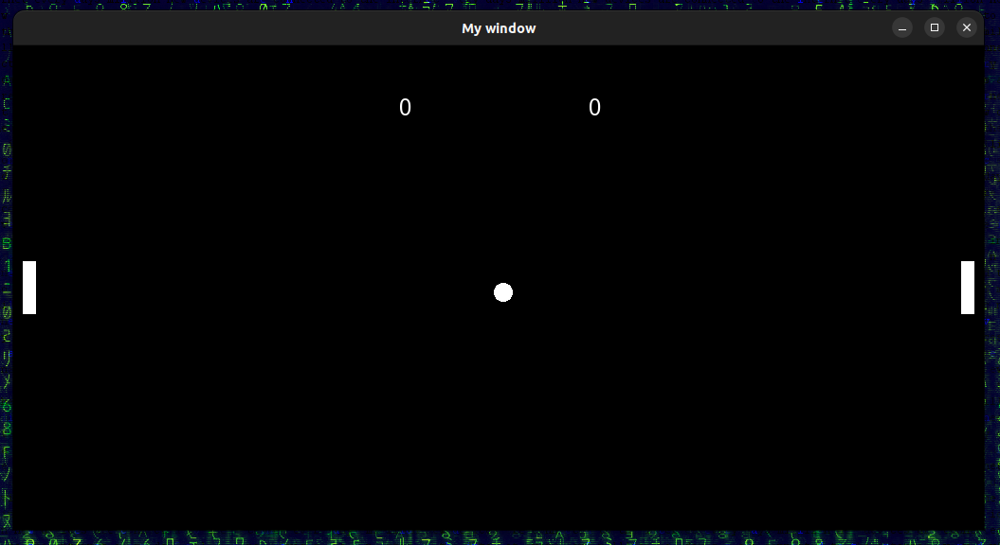
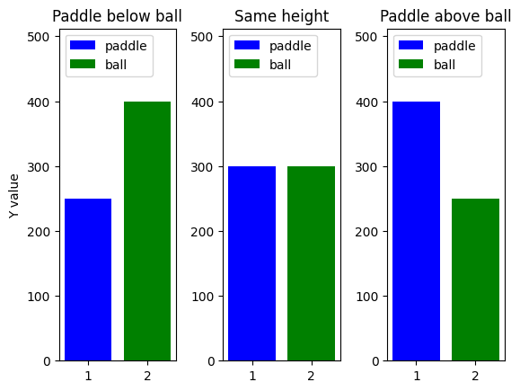
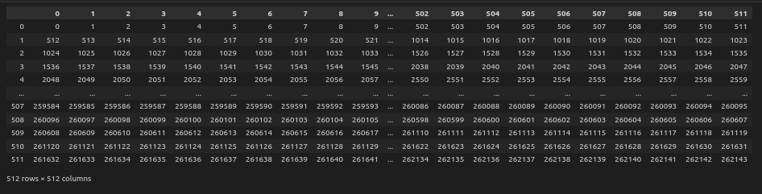
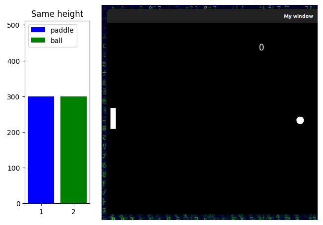
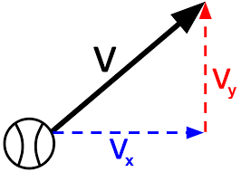
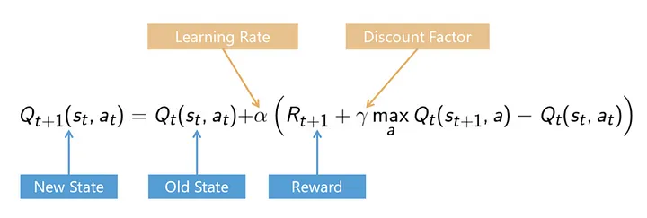

# Workshop on Qleaning for Pong using C++ & SFML

<p align = "center">

</p>


# Introduction

This is an implementation of a qlearning algorithm for the classic game of pong.<br> 
In this implementation standard c++ libraries are used in order to implement qlearning.<br> 
No external machine learning libraries are used as the implementation does not involve a neural network.<br> 

# Setup

Prerequisites: [SFML](https://www.sfml-dev.org/index.php)

    $ git clone https://github.com/BouzoulasDimitrios/Qlearning-Pong.git
    $ cd Qlearning-Pong/
    $ bash launch.sh

# Demo

**Model on the Left vs me on the Right.**

<p align = "center">

</p>

# Detailed explanaition

## summary


This model was created using a reinforcement learning algorithm called [Qlearning](https://en.wikipedia.org/wiki/Q-learning). <br>

Qleaning uses game states in order to describe what is happening in the game. <br>

For example the starting game state: <br>

<p align = "center">

</p>

In any given state of the PONG game we can describe what is happening by simply listing the game components coordintes on the game window.<br>

In the start of the game we can describe the game as following:

    Right paddle: x = 1000 , y = 228 
    Left  paddle: x = 10   , y = 228 
    Ball: x = 507, y = 251   

As a result the whole game can be described at any state by six numbers.<br>
<br>


### How decisions are made

In simple terms qlearning aims to create a table which will give us the correct move for every game state.

In pong we have 3 moves only for our model. UP, DOWN or STAY.

As a result we get a lookup table that looks like this:


|          |    UP   |  STAY   |  DOWN   |   
|----------|---------|---------|---------|
|  state 0 |  **correct**  |  **wrong**     |  **wrong** |
|  state 1 |  **wrong** |  **correct**   |  **wrong** |
|  state 2 |  **correct**  |  **wrong**     |  **wrong** |


But how does the algorithm know which action it should take for any given game state?<br>
This is where **training** takes place, the algorithm takes random actions and gets rewarded or punished based on the action it takes.<br>
After training for a while the lookup table will end up having large numeric values for the correct moves and negative ones for the wrong moves.


|          |    UP   |  STAY   |  DOWN   |   
|----------|---------|---------|---------|
|  state 0 |  0.929  | -0.892  | -0.932  |
|  state 1 | -0.988  |  0.922  | -0.894  |
|  state 2 |  0.981  | -0.878  | -0.825  |


Now during the testing phase the only thing that our model has to do is to look at the highest number for a given game state and take that action. <br>
If it was trained correctly it should be able to play the game.

# Qlearning
## Goal

The goal we have is a model that can play **pong**. <br>
Due to the simplicity of the approach it can be difficult to make the model perform fancy moves<br>
and teach it to hit the ball with nice angles.

As a result the problem is approached with a simpler goal.<br>
**"Make the model always hit the ball"**.<br>
That will be the goal for the model, and the reason for that is simple.<br>
In pong if you always hit the ball you cannot lose as a result you will win sooner or later.<br>
<br>

## calculating game states

This is one of the first problems that come up.<br>
In order to calculate all the possible game states we run into a problem.<br>
There are simply too many of them.<br>

In case we want to calculate all of the game states we have the following variables:<br>


    Right paddle: x, y
    Left  paddle: x, y
    Ball: x, y   


Now some of these variables are useless as the paddles do not move in the **X** axis.<br>

As a result we are left with the following game variables:<br>

    Right paddle: y
    Left  paddle: y
    Ball: x, y 

**Y values** range from 0 to 512 <br>
**X values** range from 0 to 1024 <br>
<br>

    Calculating the game states gives us the following number:

    game_states = 512 * 512 * 512 * 1024 => 
    game_states = 137438953472 

This leaves us with roughly 100 Billion game states which is an unpleasantly big number.<br>

As a result we should try to get it smaller.<br>
Let's start by the least relevant part, the oponents paddle height.<br>
If my goal is to hit the ball I do not have to know where the oponents paddle is.<br>

    So let's calculate the ammount of game states again leaving out the oponents paddle Y position:

    game_states = 512 * 512 * 1024 => 
    game_states = 268435456 

Still being in the hundreds of millions is not that optimal as we need to have 3 values for every game state<br>
leaving us with nearly 1 billion values.<br>

So how to optimize from here? <br>

we could apply the following approach:<br>
As we aim to always hit the ball and nothing else, the only thing that we need to do is to be on the same level as the ball.<br>

We could simply use the **ball's Y** value and the **paddle's Y** value.

    Now let's calculate again the game states without the ball's X:

    game_states = 512 * 512 => 
    game_states = 262144 

This leaves us with a number which is in the hundreds of thousands instead of hundreds of billions which is a significan improvement.

Now what the model will see is just two heights like this:


<p align = "center">
    
</p>

The result is a model that will try to always match these heights, simmilar to the middle "`Same height`"<br> plot, if the actions of the model result in the paddle being bellow or above the ball, it gets punished.

Now that we have the values that will make up our states, we need to create some function in order to calculate the state.

Since we have only 2 variables to play with. We could approach this as a **2D** martix where:<br>
  
X = Paddle's Y values<br>
Y = Ball's Y values<br>

And as a result we get a table that looks like this:

<p align = "center">
    
</p>

From this we can always assign a unique number to any game state, any combinatino of **Y** values.

In order to initialize and populate the matrix the following can be used:

``` C++
const int tableSize = 512;

std::vector<std::vector<int>> lookupTable(tableSize, std::vector<int>(tableSize, 0));


void init_state_table(std::vector<std::vector<int>> &lookupTable, int tableSize){

    int value = 0;

    for (int i = 0; i < tableSize; ++i) {
        for (int j = 0; j < tableSize; ++j) {
            lookupTable[i][j] = value;
            value++;
        }
    }

    // Print the lookup table
    for (const auto& row : lookupTable) {
        for (int val : row) {
            std::cout << val << " ";
        }
        std::cout << std::endl;
    }

    return;
}
```

Now there's only one problem left, in case the the ball is directly in the middle of the paddle, how can the model know where should it go **UP** or **DOWN** ?<br>

<p align = "center">
    
</p>

How should a decision be made in this state?<br>
From what we see the ball could be going up or down and there's no way to tell.<br>
But we can add a factor here that change's everything, we could factor in the balls *speed*.<br>

<p align = "center">
    
</p>

The ball's speed is comprised of two values, it's speed in the **X** axis and **Y** axis.<br>

But how should we input these values in order to avoid too many game states?<br>

The solution to this is the following:

    1) we only use the ball's speed on the Y axis as care primarilly about it's height.
    2) we convert the number from the float value that it is to a binary state. 
        
        if( Y ball speed > 0 )
            select state for positive Y values
        else
            select state for negative Y values
        
as a result we end up doubling our ammount of game states. Going from 262144 to => 524288<br>
which is still a managable amount of states.

Now we are ready to create a look-up table:

``` C++
std::size_t range = 262144;
const int NUMBER_OF_ACTIONS = 3;

std::vector<std::vector<float>> Qtable = std::vector<std::vector<float>>(2*range, std::vector<float>(NUMBER_OF_ACTIONS, 0.0f));
```
as a result we get the following table:
       
       | 0 1 2
    ------------- 
    1  | 0 0 0 
    2  | 0 0 0 
    3  | 0 0 0 
    4  | 0 0 0 
    5  | 0 0 0 
    6  | 0 0 0 
    7  | 0 0 0 
    8  | 0 0 0 
    9  | 0 0 0 
    10 | 0 0 0 
    11 | 0 0 0 
    12 | 0 0 0 
    13 | 0 0 0 
    14 | 0 0 0 


where the numbers on the Y axis represent the game state and the numbers on the X the actions.

    0 = Down
    1 = Stay
    2 = Up

## How does Qlearning work?

Qlearning works using the flollowing steps:

    1) Exploration: the model performs random actions and adjusts the values on the lookup table based on the
    rewards or punishments it recieves.

    2) Exploitation: After the exploration stage we enter the exploitation stage, the model keeps on learning
    the difference now is that it's movements use the information that it gained from the exploration stage
    meaning that it does not perform rendom movements but selects the ones that it percieves to be correct.

    3) After spending time in the exploitation stage our model should be able to select the correct action for any given game state and perform it. In our case that means having the same Y value as the ball at all times.


Let's start with the exploration part as it comes first:

``` C++
float exploration_rate = 1;
float min_exploration_rate = 0.01;
float max_exploration_rate = 1; 
float exploration_decay_rate = 0.01;

exploration_rate = min_exploration_rate + (max_exploration_rate - min_exploration_rate) * exp(-exploration_decay_rate * (r_points + 1000));

```

The value of the exploration rate starts out at **1** but it keeps getting smaller as the game goes on<br>
and it goes down until it reaches the minimum exploration rate that we've allowed for.

### Updating the look-up table

- Every game loop an action is chosen
- we read the reward/punishment and the next state of the game
- the lookup table values are updated:

The update happends using the following function:

<p align = "center">
    
</p>

In code:

``` c++
void update_qtable(std::vector<std::vector<float>> &Qtable, int game_state_end, int game_state_start, float learning_rate, float discount_rate, float reward, int action ){

    int next_move = static_cast<int> (*max_element(std::begin(Qtable[game_state_end]), std::end(Qtable[game_state_end])));

    Qtable[game_state_start][action] = Qtable[game_state_start][action] * (1 - learning_rate) + learning_rate * (reward + discount_rate * next_move);

}

```

## Connecting it all

Now to put all of these pieces together: 

first we need to initialize the state table and the look-up table

``` c++
std::vector<std::vector<float>> Qtable = std::vector<std::vector<float>>(2*range, std::vector<float>(NUMBER_OF_ACTIONS, 0.0f));

std::vector<std::vector<int>> lookupTable(tableSize, std::vector<int>(tableSize, 0));

void init_state_table(lookupTable, tableSize);

```

Now that we have these we read in the game state, we create a struct that represents our game state<br>
and we retrieve the values that we need from the game:

``` c++
struct State {
  float paddle1, paddle2; // paddle positions
  float ball_x, ball_y;   // ball position
};

pos = pg.ball.getPosition();
l_paddle_pos = pg.left_paddle.getPosition();
pos.x += velX, pos.y += velY;

//starting state
start_state.ball_x = pos.x;
start_state.ball_y = abs(pos.y);
start_state.paddle1 = l_paddle_pos.y;
```

Now we have a representation of the game, and we need to calculate the game state:


``` c++
int state_calc(std::vector<std::vector<int>> & lookupTable, struct State & state, float velocity, std::size_t range){

    if(velocity > 0){
        // cout<<"POSTITIVE"<<velocity<<endl; //state.ball_x, 
        return range + lookupTable[state.ball_y][state.paddle1];     
    }else{
        // cout<<"NEGATIVE"<<velocity<<endl; //state.ball_x, 
        return range - lookupTable[state.ball_y][state.paddle1];     
    }

    return lookupTable[state.ball_y][state.paddle1];

}

game_state_start = state_calc(lookupTable,  start_state, velY, range);
```
Now that we have the state of the game, we need to select an action:

``` c++
int select_action(int game_state, std::vector<std::vector<float>> &Qtable, float exploration_rate){

    int action;
    exploration_rate = 0;
    if(0.2 > exploration_rate){
        auto it = std::minmax_element(Qtable[game_state].begin(), Qtable[game_state].end());
        int max_idx = std::distance(Qtable[game_state].begin(), it.second);
        return max_idx;
    }

    action = rand() % 3;
    std::cout<<"ACTION  RANDOM = "<<action<<std::endl;
    return action;

}
```
This function factors in the exploration rate, which means that for the first part of the training the model<br>
will be behaving randomly and thus 'exploring' the environment, afterwards when the exploration rate is low it<br>
will start selecting actions based on what it has learned and continue from there.

Now we also need to calculate what would be a correct action:

``` c++
int correct_move_calculator(State state1, float vel){

    if(vel >= 0){
        if(state1.paddle1 + 28 > state1.ball_y)
            return 1;
        else if(state1.paddle1 + 28 < state1.ball_y)
            return 2;
    }else{
        if(state1.paddle1 + 28 > state1.ball_y)
            return 0;
        else if(state1.paddle1 + 28 < state1.ball_y)
            return 1;
    }

    return 0; // avoid compiler warning
}
```

after we select our action and the game loop is over we compare it to the correct action,<br> 

```c++
    reward = (action == correct_move) ? 1 : -1;
```

Here if the action matches the correct one the model is rewarded else it's punished. <br>


After every game loop we also update the loopup table values based on our reward/punishment:

```c++
update_qtable(Qtable, game_state_end, game_state_start, learning_rate, discount_rate, reward, action);

```

After a certain ammount of loops the model will be at a state where it can play the game on it's own.
Performing the perfect move always and staying on level with the ball at all times.

With the weights that I have currenly saved the model should be impossible to beat but feel free to try to do so.<br>

## conclusions

A reinforcement learning model can be trained to play pong having only 3 values from the game, the paddle's height the ball's height and the speed of the ball on the Y axis.<br>

All of the data for the game can be retrieved from the mdoel using the functions provided, feel free to explore different ways to train the model in the least ammount of time possible, and with the smallest ammount of game states possible.


# Resources:

[medium.com](https://medium.com/@nancyjemi/level-up-understanding-q-learning-cf739867eb1d)

[video series](https://www.youtube.com/watch?v=nyjbcRQ-uQ8&list=PLZbbT5o_s2xoWNVdDudn51XM8lOuZ_Njv)
